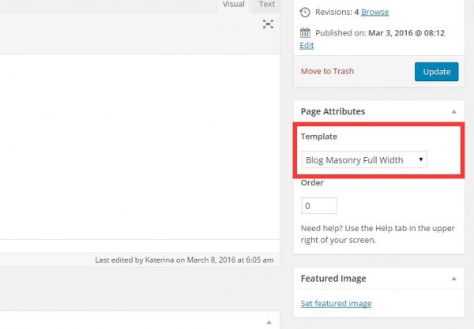

在编辑wp站点的时候，我发现站点页面编辑器的模板选项不见了



而且无法通过切换主题来恢复: 主题选项只显示当前主题

可使用以下方法:
```shell
//在网站服务器的命令行输入,如果没有root权限请加上'sudo'
vi /usr/local/php/etc/php.ini
 
//查找文件中的'scandir'字段
/scandir
 
//删除'disable_funcions='后的'scandir,'
 
//重启网站服务器,我使用的lnmp
lnmp restart
```